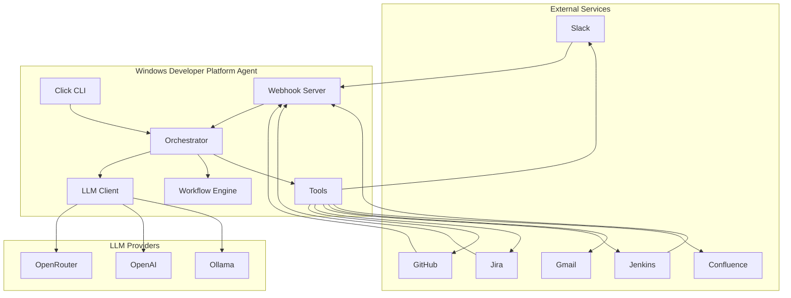
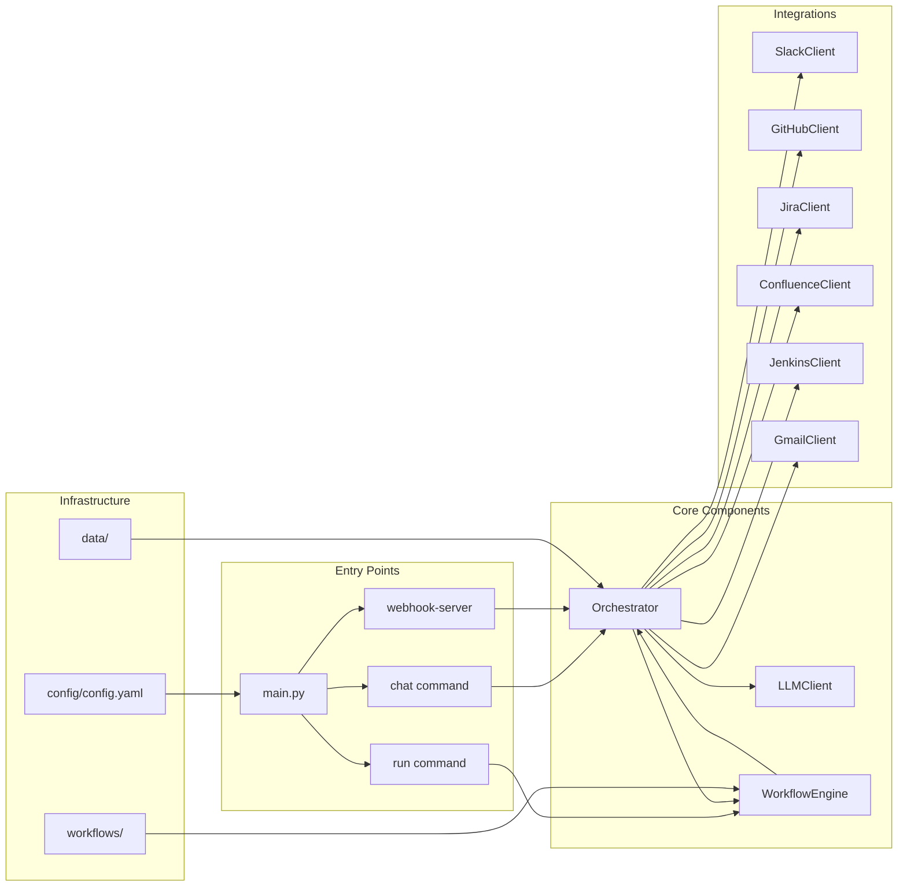
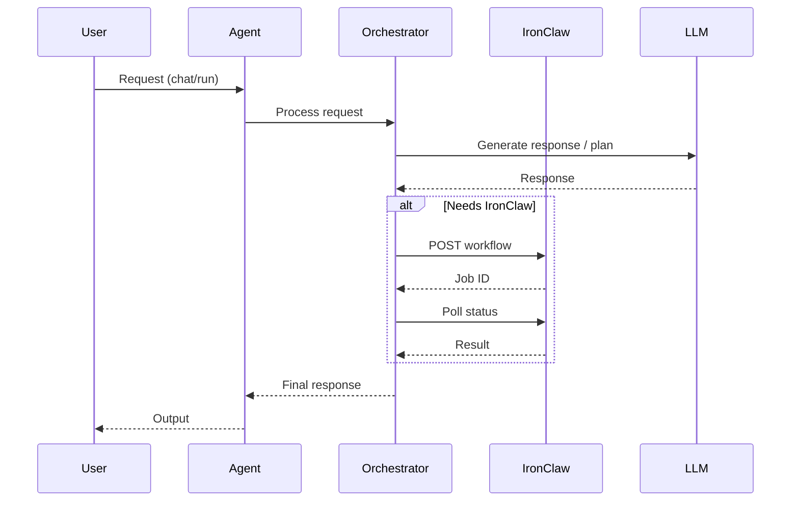
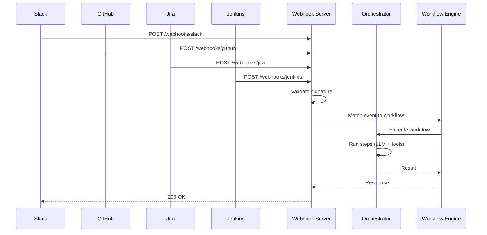
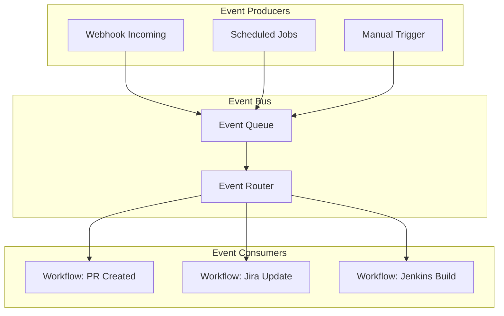
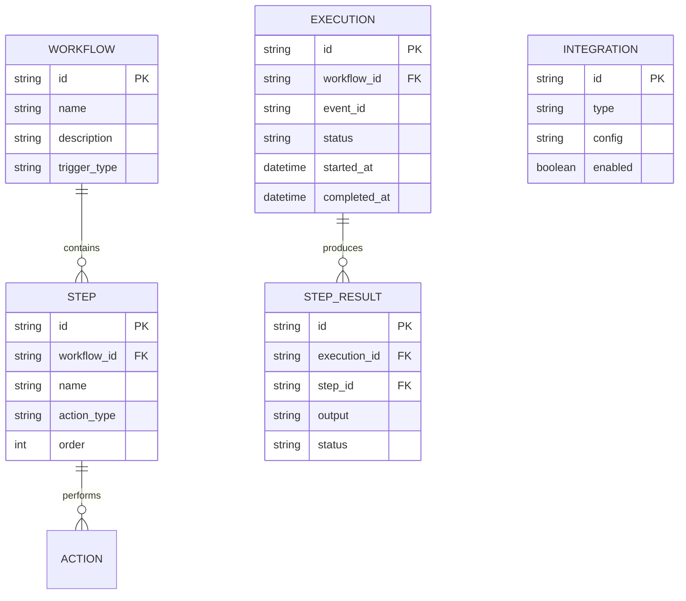
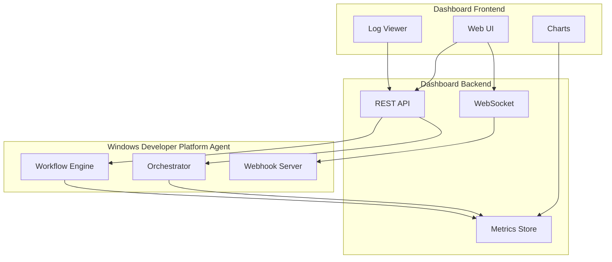

# Windows Developer Platform Agent — Architecture

This document describes the architecture of the **Windows Developer Platform Agent**, the Windows port of Claw Agent. It connects Slack, GitHub, Jira, Jenkins, Gmail, and Confluence with event-driven workflows.

> **Platform note:** All file paths use `pathlib.Path` for Windows compatibility. No hardcoded Unix paths.

---

## 1. System Overview



---

## 2. Component Architecture



---

## 3. IronClaw Flow

IronClaw is the external workflow execution service. The agent calls it for long-running or complex operations.



---

## 4. Webhook Flow

Webhooks receive events from external services and trigger workflows.



---

## 5. Event Bus

Internal event flow between components.



---

## 6. Data Model



---

## 7. Dashboard

Planned dashboard architecture for monitoring and control.



---

## File Layout (Windows)

All paths use `pathlib.Path`:

```
Windows-developer-platform-agent/
├── main.py                 # Entry point
├── config/
│   └── config.yaml        # Configuration
├── agent/
│   ├── llm.py             # LLM client
│   ├── orchestrator.py    # Orchestrator
│   ├── workflow_engine.py # Workflow execution
│   └── tools.py           # Tools (summarize, etc.)
├── integrations/
│   ├── slack.py
│   ├── github.py
│   ├── jira.py
│   ├── confluence.py
│   ├── jenkins.py
│   └── gmail.py
├── server/
│   └── webhook.py         # FastAPI webhook server
├── workflows/             # Workflow definitions
├── data/                  # Runtime data, DB fallback
└── logs/                  # Log files
```

---

## Environment Variables

See `.env.example` for the full list. Key variables:

- `OPENROUTER_API_KEY` / `OPENCLAW_API_KEY` — LLM provider key
- `SLACK_BOT_TOKEN`, `SLACK_APP_TOKEN`, `SLACK_SIGNING_SECRET`
- `GITHUB_TOKEN`, `GITHUB_WEBHOOK_SECRET`
- `JIRA_URL`, `JIRA_USER`, `JIRA_API_TOKEN`
- `JENKINS_URL`, `JENKINS_USER`, `JENKINS_API_TOKEN`
- `GMAIL_CREDENTIALS_FILE`, `GMAIL_TOKEN_FILE` (paths resolved via `pathlib`)
- `WEBHOOK_HOST`, `WEBHOOK_PORT`
- `DATABASE_URL`
